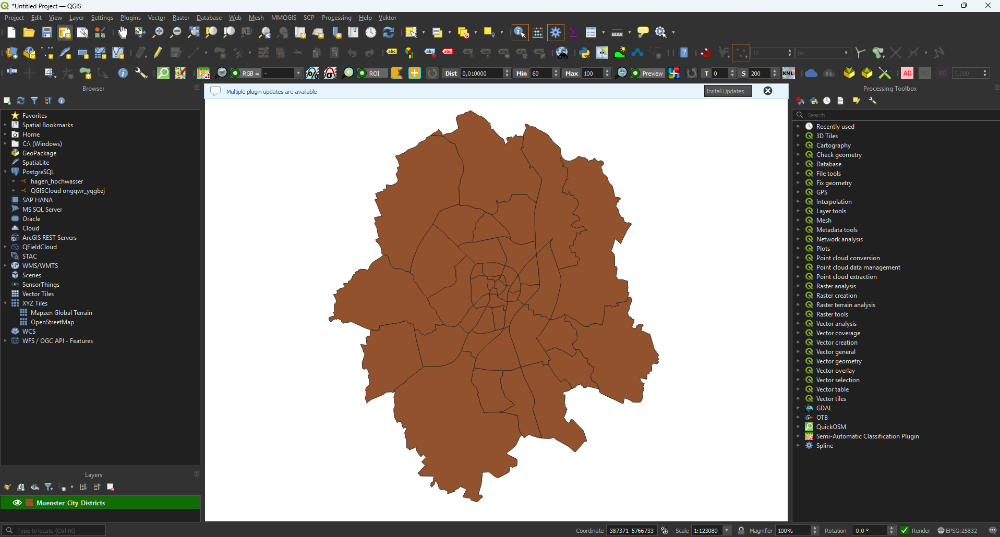
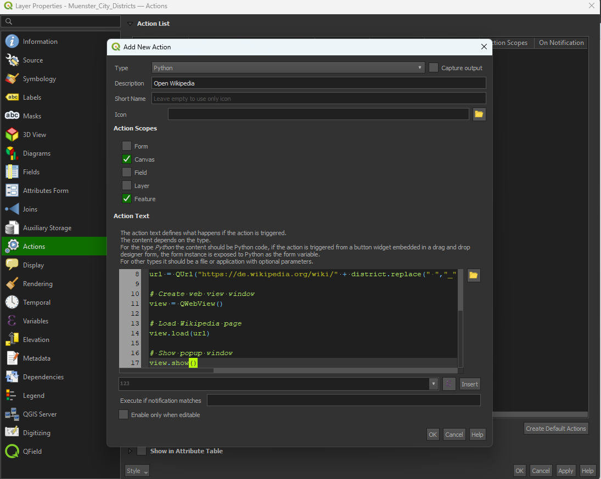
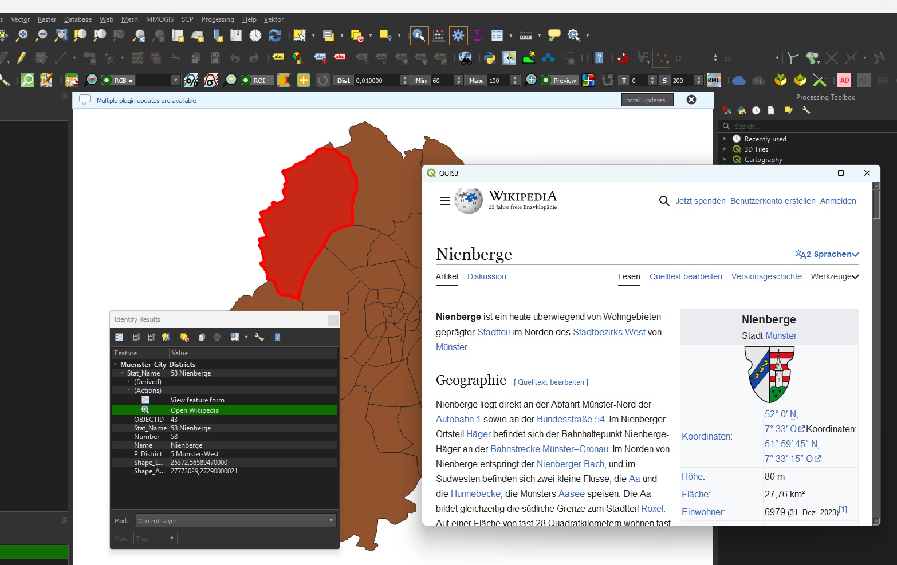

# Exercise 4.1

1. Open QGIS and load the layer `Muenster_City_Districts.shp`.

2. Open the layer properties, go to **Actions**, and add a new action.

3. Set the action type to **Python** and name it something like **Open Wikipedia**.

4. Copy the code from [exercise_4_1.py](exercise_4_1.py) into the action editor.

5. Confirm the action by clicking **OK**.

6. Use **Identify Features**, click on a district, and run the action **Open Wikipedia**.

