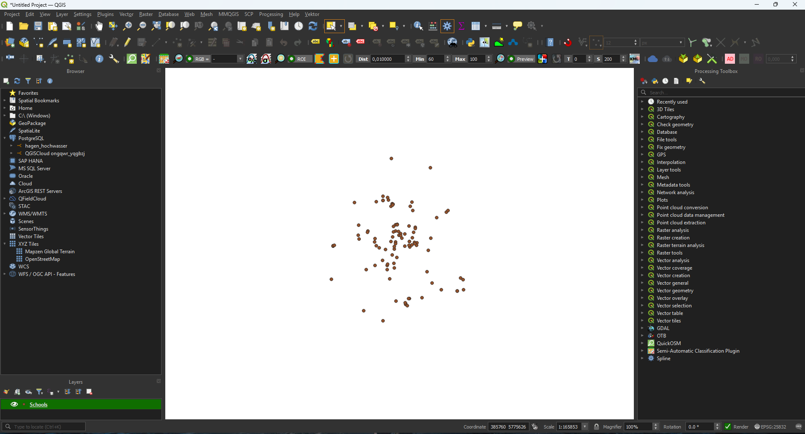
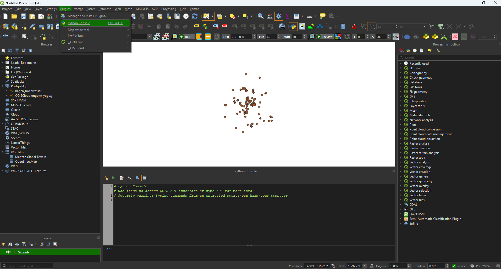
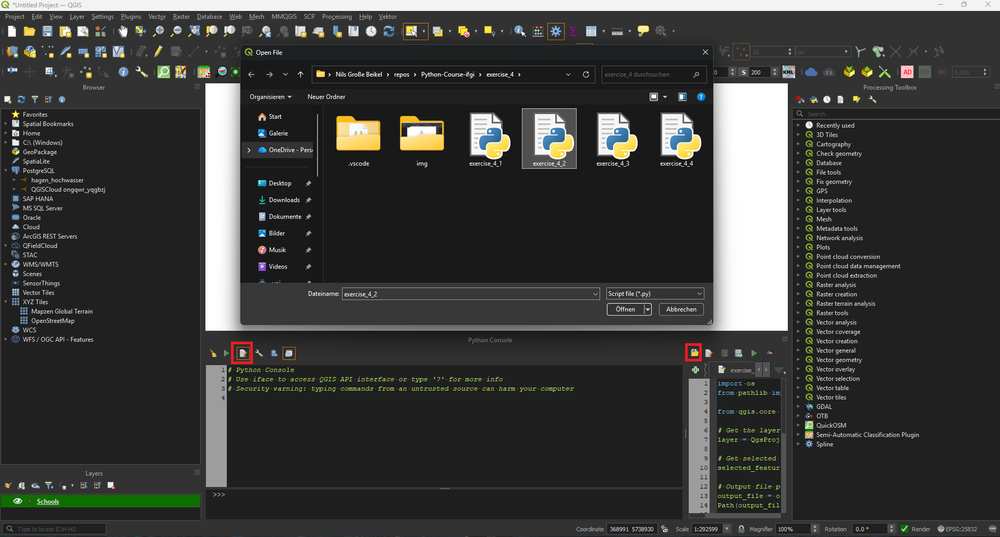
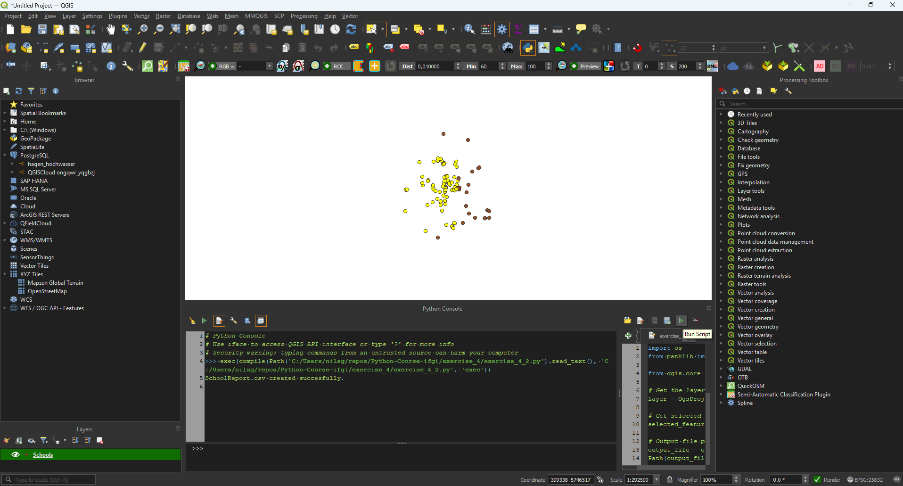
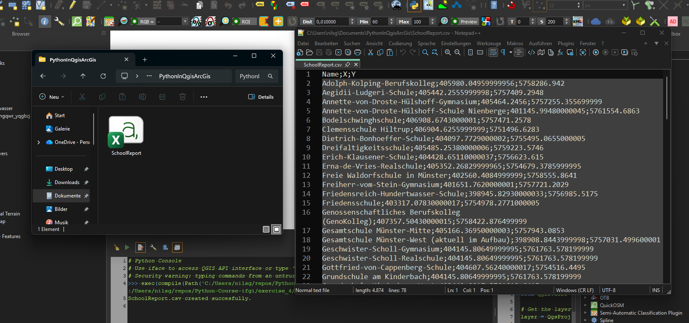
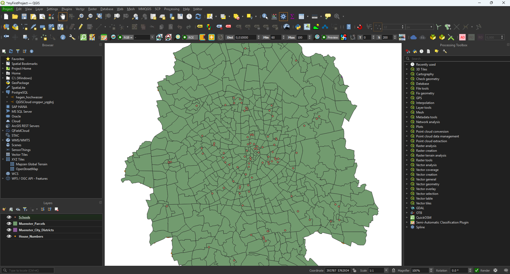

# Exercise 4.1

1. Open QGIS and load the layer `Muenster_City_Districts.shp`.


2. Open the layer properties, go to **Actions**, and add a new action.

3. Set the action type to **Python** and name it something like **Open Wikipedia**.

4. Copy the code from [exercise_4_1.py](exercise_4_1.py) into the action editor.


5. Confirm the action by clicking **OK**.

6. Use **Identify Features**, click on a district, and run the action **Open Wikipedia**.


# Exercise 4.2

1. Open QGIS and load the layer `Schools.shp`.



2. Open the Python console.



3. Open the Python editor and load the script [exercise_4_2.py](exercise_4_2.py).



4. Select one or more school features and run the script.



5. The CSV file is saved to `%USERPROFILE%\Documents\PythonInQgisArcGis\SchoolReport.csv` and can be opened with a text editor.



# Exercise 4.3

1. Make sure the folder `%USERPROFILE%\Documents\PythonInQgisArcGis\Muenster` exists and contains the input shapefiles (`.shp` and related files).

2. Copy the example environment file to `.env` if you do not already have one:

	```
	cp .env.example .env
	```

3. Open `.env` and set `QGIS_VERSION` to the version of QGIS you have installed, for example `3.42.1`.

4. Run the script in a terminal with the QGIS launcher that matches your installed version:

	```
	& "C:\Program Files\QGIS 3.42.1\bin\python-qgis.bat" "c:\Users\nilsg\repos\Python-Course-ifgi\exercise_4\exercise_4_3.py"
    ```

    or

    ```
    & "C:\Program Files\QGIS 3.44.9\bin\python-qgis-ltr.bat" "c:/Users/cedri/OneDrive/Desktop/Uni/PythonInQgisArcGis/Python-Course-ifgi/exercise_4/exercise_4_3.py"
	```

5. The script creates the project file at `%USERPROFILE%\Documents\PythonInQgisArcGis\myFirstProject.qgz`.

6. Open this `.qgz` file in QGIS to verify that all layers were added.


